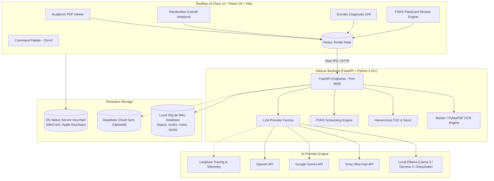

<div align="center">

# 🧠 Recall (RecallAI)
### *The Next-Generation Academic Learning Companion & Spaced Repetition Engine*

Transform static textbooks into an interactive, first-principles learning pipeline.  
Combines **Marker-powered LaTeX PDF parsing**, an **authentic student handwritten Cornell notebook**, **per-concept Socratic diagnostic drills**, and the state-of-the-art **FSRS memory algorithm**.

[](https://tauri.app/)
[](https://reactjs.org/)
[](https://fastapi.tiangolo.com/)
[](https://www.python.org/)
[](https://github.com/open-spaced-repetition/fsrs4anki)
[](https://ollama.ai/)
[](https://katex.org/)
[](https://sqlite.org/)

<br/>

[✨ Core Features](#-core-features) • [⚖️ Feature Matrix](#️-why-recall-the-comparison) • [📝 Handwritten Notes](#-authentic-handwritten-student-notes) • [🎯 Socratic Drills](#-per-concept-socratic-diagnostic-drills) • [⚡ FSRS Algorithm](#-fsrs-spaced-repetition-scheduler) • [🏗️ Architecture](#️-system-architecture) • [🚀 Quick Start](#-quick-start)

---

</div>

## 💡 The Philosophy: From Passive Reading to Active Mastery

Most PDF study tools are built around **passive summarization** ("Chat with your PDF") or **tedious manual rote work** (writing thousands of flashcards in Anki). 

**True academic mastery demands causal understanding, not superficial recognition.**

**Recall** bridges this divide:
1. **Never read passively again**: Textbooks are automatically dissected into bite-sized, atomic conceptual units.
2. **First-Principles Examination**: A built-in Socratic AI examiner grills you with open-ended diagnostic questions, grades your free-form responses, pinpoints exact conceptual misconceptions, and gently nudges you toward the right answer.
3. **Pristine Mathematical Retention**: Equations, matrix transformations, and theorems are preserved in full LaTeX notation with authentic handwritten notebook aesthetics and gel-pen ink.
4. **Permanent Memory Consolidation**: Gaps diagnosed during your drills automatically synthesize into targeted flashcards scheduled by the modern **FSRS-4.5** spaced repetition algorithm.

---

## ⚖️ Why Recall? The Comparison

| Capability | Generic PDF Chat (ChatPDF / NotebookLM) | Traditional Flashcards (Anki / Quizlet) | 🧠 **Recall** |
| :--- | :---: | :---: | :---: |
| **Active Socratic Grilling** | ❌ Passive Q&A only | ❌ Self-graded binary flip | ✅ **Automated Short Answer Grading (ASAG)** with Socratic nudges |
| **Mathematical Precision** | ⚠️ Often strips or mangles LaTeX math | ⚠️ Manual LaTeX card syntax | ✅ **Marker OCR**: Flawless LaTeX formulas, matrices & diagrams |
| **Cornell Study Guides** | ⚠️ Generic bulleted summaries | ❌ None | ✅ **Structured Cornell Guides**: Invariants, Derivations, Exam Pitfalls & Cues |
| **Aesthetic Experience** | ❌ Sterile corporate chat interface | ❌ Outdated 2000s desktop UI | ✅ **Student Notebook**: College ruled, dot grid, gel-pen ink & highlighters |
| **Spaced Repetition** | ❌ No memory retention engine | ⚠️ 35-year-old SM-2 algorithm | ✅ **Modern FSRS-4.5**: DSR modeling (Difficulty, Stability, Retrievability) |
| **Privacy & Local Models** | ❌ Uploads documents to cloud servers | ✅ Local data | ✅ **100% Local-First** via Ollama (Gemma 3, Llama 3, DeepSeek) + encrypted cloud fallback |
| **Textbook Structure** | ❌ Blind text chunks | ❌ Manual deck organization | ✅ **Automated Table of Contents & Atomic Concept Subdivision** |

---

## ✨ Core Features

```
┌──────────────────────────────────────────────────────────────────────────────────┐
│                                 RECALL WORKFLOW                                  │
│                                                                                  │
│   [ Academic PDF ] ──► [ Marker Vision OCR ] ──► [ TOC & Concept Slicer ]       │
│                                                            │                     │
│               ┌────────────────────────────────────────────┴────────┐            │
│               ▼                                                     ▼            │
│   [ 📝 Handwritten Cornell Notes ]                   [ 🎯 Socratic Drill ]       │
│    • College Ruled / Dot Grid Paper                   • Automated Grading        │
│    • Gel-Pen Ink LaTeX Math                           • Misconception Diagnosis  │
│    • Real Pastel Highlighters                         • First-Principles Nudges  │
│               │                                                     │            │
│               └──────────────────────┬──────────────────────────────┘            │
│                                      ▼                                           │
│                      [ ⚡ FSRS-4.5 Memory Consolidation ]                       │
│                       • Adaptive Review Intervals (DSR)                          │
│                       • Interactive Flip Card Sessions                           │
└──────────────────────────────────────────────────────────────────────────────────┘
```

### 📝 Authentic Handwritten Student Notes
*Notes shouldn't look like sterile Word documents—they should feel like your personal, high-yield notebook.*
- **Three Realistic Paper Styles**: Switch seamlessly between **College Ruled** (soft blue ruling with red margin line), **Engineering Dot Grid** (24px technical grid), and **Clean Warm Paper**.
- **Handwritten Typography**: Styled with organic handwriting fonts (`Kalam` for detailed explanations, `Caveat` for expressive headings) that naturally align to notebook rules.
- **High-Contrast Gel-Pen Math**: KaTeX display and inline formulas render in rich Pilot blue gel-pen ink (`#1e3a8a`), ensuring fractions, matrix brackets, superscripts, and Greek letters pop with 100% clarity.
- **Pastel Highlighters & Sticky Notes**: Core terms receive real semi-transparent pastel highlighter strokes, while Exam Pitfalls and Warnings are presented as yellow sticky notes taped to the page.
- **1-Click AI Cornell Synthesizer**: Generates comprehensive notes with:
  - 🎯 **Core Invariants & Definitions**
  - 🧠 **Step-by-Step Mechanisms & Derivations**
  - ⚠️ **Common Exam Pitfalls & Misconceptions**
  - 📌 **Self-Testing Cue Questions (Active Recall)**

<details>
<summary><b>🔍 Click to preview sample rendered LaTeX handwritten note</b></summary>

```markdown
# 📝 1.4. Inverses; Rules of Matrix Arithmetic

## 🎯 Core Invariants & Definitions
* **Non-Commutativity**: Matrix multiplication is not commutative ($AB \neq BA$).
* **Matrix Inverse**: For an $n \times n$ matrix $A$, if there exists $B$ such that:
$$AB = BA = I$$
then $A$ is **invertible** and $B = A^{-1}$.

## ⚠️ Common Exam Pitfalls & Misconceptions
> ⚠️ **Cancellation Fallacy**: $AB = AC$ does NOT imply $B = C$ unless $A$ is invertible!
> Furthermore, $AB = 0$ does not mean $A = 0$ or $B = 0$.
```

</details>

---

### 🎯 Per-Concept Socratic Diagnostic Drills
*Stop guessing whether you actually understand the material.*
- **Automated Short Answer Grading (ASAG)**: Formulate your answers in your own words. Recall evaluates your response against ground truth text, scoring accuracy, depth, and precision.
- **Socratic Nudging**: If your answer has a gap or misconception, the AI doesn't spoil the solution—it provides targeted Socratic hints to guide you to the conclusion yourself.
- **Remedial Flashcard Auto-Generation**: Discovered misconceptions can be saved directly as active recall cards with one click.

<details>
<summary><b>💬 Click to see an interactive Socratic Drill dialogue</b></summary>

> **Socratic Examiner:** *"In linear algebra, if $AB = 0$ for two non-zero square matrices $A$ and $B$, can either $A$ or $B$ be invertible? Explain why or why not using matrix invariants."*
>
> **Student Answer:** *"Yes, because as long as one of them is zero, the multiplication becomes zero."*
>
> **Diagnostic Assessment:**
> - ❌ **Misconception Identified**: Zero-Product Fallacy from scalar arithmetic.
> - 💡 **Socratic Nudge**: *"Consider what happens if you multiply both sides of $AB = 0$ on the left by $A^{-1}$, assuming $A$ is invertible. What would the equation simplify to?"*
> - 📌 **Remedial Card Generated**: *"Why can't an invertible matrix be a zero divisor in matrix multiplication?"*

</details>

---

### ⚡ FSRS Spaced Repetition Scheduler
Recall implements the cutting-edge **Free Spaced Repetition Scheduler (FSRS-4.5)**, modernizing spaced repetition beyond the 1980s SM-2 algorithm used in legacy tools:
- **DSR Modeling**: Tracks memory based on three cognitive pillars:
  - **D** (*Difficulty*): How inherently challenging the concept is.
  - **S** (*Stability*): How many days it will take for recall probability to drop to 90%.
  - **R** (*Retrievability*): Current probability of successfully recalling the card.
- **Fewer Reviews, Higher Retention**: Replaces arbitrary interval jumps with mathematically grounded decay curves, reducing overall review load by 20–30% while maintaining targeted retention.
- **Rich Card Reviews**: Clean front/back flip cards with keyboard shortcuts (`Space` to flip, `1` Again, `2` Hard, `3` Good, `4` Easy).

---

### 📚 Marker Vision PDF Ingestion
Academic textbooks are filled with mathematical notation, multi-column layouts, diagrams, and complex matrices that traditional PDF extractors butcher into unreadable ASCII garbage.
- **Powered by Marker**: Leverages high-accuracy vision pipelines to reconstruct clean Markdown from PDFs.
- **Preserved Figures & Diagrams**: Embedded schematics and charts are automatically extracted, cropped, and presented with click-to-zoom lightboxes.
- **Smart Heading Normalization**: Roman numerals (`IV.`), multi-level decimals (`1.4.2`), and uppercase headers are parsed into a synchronized Table of Contents.

---

### 🔒 100% Local-First Privacy & Multi-Provider Architecture
Your textbooks, lecture notes, and study records belong to you.
- **Local LLMs via Ollama**: Run models like `gemma3:4b`, `llama3.1:8b`, `deepseek-r1`, or `qwen2.5` completely offline with zero telemetry.
- **Hardware-Accelerated Cloud Fallback**: Optionally enable cloud acceleration with **Groq** (sub-second inference), **Google Gemini**, or **OpenAI**.
- **OS Keychain Security**: Cloud API keys are stored in your operating system's native encrypted keychain (Windows Credential Manager / macOS Keychain), never in plaintext files.
- **Langfuse Telemetry**: Native support for Langfuse tracing to monitor LLM token usage, latency, and prompt accuracy.

---

## 🏗️ System Architecture

Recall utilizes a high-performance **Monorepo Sidecar** architecture:



---

## 🚀 Quick Start

### Prerequisites
- [Node.js](https://nodejs.org/) (v18+) & [pnpm](https://pnpm.io/)
- [Python](https://www.python.org/) (3.10+)
- [Rust Toolchain](https://www.rust-lang.org/) (for Tauri v2 compilation)
- *(Optional)* [Ollama](https://ollama.ai/) for 100% private local AI

---

### Step 1: Clone the Repository
```bash
git clone https://github.com/Saimun-jd/RecallAI.git
cd RecallAI
```

---

### Step 2: Set Up Backend Environment
```bash
# Create and activate Python virtual environment
python -m venv .venv

# On Windows:
.venv\Scripts\activate
# On macOS/Linux:
# source .venv/bin/activate

# Install dependencies
pip install -r requirements.txt
```

---

### Step 3: Run in Development Mode
To enjoy hot-reloading across both backend and frontend, run the services in two separate terminals:

**Terminal 1 — Python FastAPI Backend:**
```bash
uvicorn app.main:app --port 8000 --reload
```

**Terminal 2 — Tauri + React Desktop App:**
```bash
cd desktop
pnpm install
pnpm tauri dev
```

---

### Step 4: Configure Your AI Provider
1. Open Recall and navigate to **Settings** (`⚙️`).
2. Choose your preferred provider:
   - **Local (100% Private)**: Select **Ollama**, specify your model (e.g. `gemma3:4b` or `llama3.1`).
   - **Cloud (Ultra-Fast)**: Enter your API key for **Groq**, **Gemini**, or **OpenAI**. Your keys are encrypted directly into your OS keychain.
3. *(Optional)* Add your **Langfuse** public & secret keys for full LLM observability.

---

## ⌨️ Keyboard Shortcuts Cheat Sheet

| Shortcut | Action | Description |
| :--- | :--- | :--- |
| `Ctrl + K` / `Cmd + K` | **Command Palette** | Quick-jump to any book, chapter, or atomic concept |
| `Ctrl + P` / `Cmd + P` | **PDF Command Palette** | Jump to specific page or search section in active document |
| `Space` | **Flip Flashcard** | Reveal card answer during FSRS review session |
| `1` | **Again (FSRS)** | Card review grade: Complete blackout or failure |
| `2` | **Hard (FSRS)** | Card review grade: Recalled with significant hesitation |
| `3` | **Good (FSRS)** | Card review grade: Standard successful recall |
| `4` | **Easy (FSRS)** | Card review grade: Instant, effortless recall |
| `Esc` | **Close Overlays** | Exit image lightboxes, command palettes, and modal views |

---

## 📦 Building Standalone Binaries for Production

To create an optimized production installer (`.msi` / `.exe` on Windows):

```bat
# Execute the automated build script
.\build.bat
```

The installer will be compiled and packaged into the `release/` directory with the Python backend automatically bundled as a private Tauri sidecar.

---

## 🤝 Contributing & Community

Contributions are what make the open-source community such an amazing place to learn, inspire, and create.
1. Fork the Project
2. Create your Feature Branch (`git checkout -b feature/SocraticEnhancement`)
3. Commit your Changes (`git commit -m 'Add Socratic multi-step drill verification'`)
4. Push to the Branch (`git push origin feature/SocraticEnhancement`)
5. Open a Pull Request

---

<div align="center">

**Built with precision for students, researchers, and lifelong learners.**  
*Master anything. Remember everything.*

</div>
